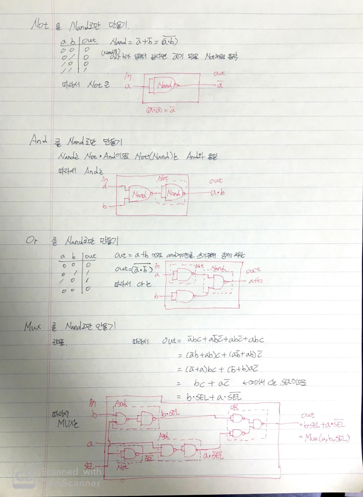
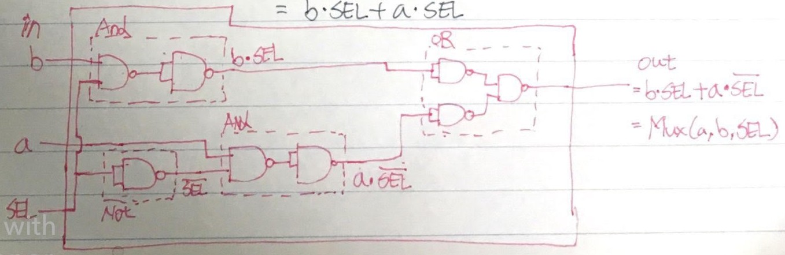

# 시작이유

# Week1
[week1 source code](./week1)




# Week3
[week1 source code](./week3)

# 고찰

## Week1

### 인터페이스의 중요성
하드웨어를 직접 그려보면서 느꼈던 점은 인터페이스가 훨씬 눈으로 잘 들어왔다는 점이다. 이러한 생각은 곧바로 다음날 코드를 작성할 때 영향을 주었다. 마치 함수 하나가 하드웨어처럼 `in`, `out`을 가지고 있는 물리 칩처럼 느껴져, 생각이 들어 코드 위에 있는 함수들이 비단 눈에 보이지 않는 작은 세계에 존재하는 것이 아니라 마치 손에 잡힐 듯한 함수로 느껴졌다.

`in`은 `params` 또는 `arguments`, `out`은 `return`으로 느껴져 변경이 필요하면, 물리 세계에서 처럼 코드도 인터페이스의 변경은 더욱 세심하게 해야겠다고 생각했다. 

### `private` 또는 `전역 객체` 참조
하드웨어에서 `in`과 `out`으로 표현 되지 않은 `node`는 외부에서 접근이 불가능하다. 상상력을 발휘해서, 칩을 만들었다고 생각하면 노출 된 곳 외에는 절대로 칩 내부의 어떤 `node`에도 결선할 수 없는 것이다. 역도 마찬가지이다. 하드웨어 내부에서는 어떤 경우에도 외부의 `node`와 결선할 수 없다. 오직 인터페이스로만 통신할 수 있다.

이러한 관점에서 봤을 때 함수 내에서는 보다 엄격하게 접근을 제한할 필요가 있을 것 같다. 테스팅을 할 때도 마찬가지이다. 내부 `node`에는 멀티테스터기를 찍어볼 수 없는 것처럼, 함수나 객체를 테스트할 때 내부 변수나, `private`field에 절대로 접근할 수 없는 것이다. 

조만간 `typesciprt`를 배워 넘어갈 예정이지만, 특히나 `javascript`는 이러한 제한이 없어서 문득 문득 망각할 때가 있다.

### 코드 vs 그림
코드와 비교 했을때 어떤 경우는 그림이 더 와닿는 경우가 있었다.

MUX16을 그림과 코드로 표현한 것이다.

* 코드
    ```js
    CHIP Mux16 {
        IN a[16], b[16], sel;
        OUT out[16];

        PARTS:
            Mux(a=a[0], b=b[0], sel=sel, out=out[0]);
            Mux(a=a[1], b=b[1], sel=sel, out=out[1]);
            Mux(a=a[2], b=b[2], sel=sel, out=out[2]);
            Mux(a=a[3], b=b[3], sel=sel, out=out[3]);
            Mux(a=a[4], b=b[4], sel=sel, out=out[4]);
            Mux(a=a[5], b=b[5], sel=sel, out=out[5]);
            Mux(a=a[6], b=b[6], sel=sel, out=out[6]);
            Mux(a=a[7], b=b[7], sel=sel, out=out[7]);
            Mux(a=a[8], b=b[8], sel=sel, out=out[8]);
            Mux(a=a[9], b=b[9], sel=sel, out=out[9]);
            Mux(a=a[10], b=b[10], sel=sel, out=out[10]);
            Mux(a=a[11], b=b[11], sel=sel, out=out[11]);
            Mux(a=a[12], b=b[12], sel=sel, out=out[12]);
            Mux(a=a[13], b=b[13], sel=sel, out=out[13]);
            Mux(a=a[14], b=b[14], sel=sel, out=out[14]);
            Mux(a=a[15], b=b[15], sel=sel, out=out[15]);
    }
    ```

* 그림
    

UML이 필요한 경우가 이런 경우가 아닐까? 물론 어떤 경우는 코드가 더 눈에 띄기 쉬울 수 있겠다. 따라서 경우에 따라 선택하는 `trade-off`를 항상 유념해야 하겠다. 이외에 주의할 점은 코드 외에 산출물을 만드는 경우 항상 최신상태를 유지 해야한다는 점이다.(코드가 변경되면 그것을 반영하는 산출물도 항상 같이 변해야 할 것).

이러한 특성은 언어에 따라 다를 수 있지도 않을까라고 잠시 생각해본다. 고민해본다. 또는 만약 코드로 구현된게 `Mux`로만 쓰여진게 아니라 `Or`나 `And`로 써졌으면 훨씬 읽기 쉬울 것이다.

> 점선에 해당하는 것은 prviate function 같다는 생각이 들었다.

## Week3


# Tip and Trick
### Run Hardware Simulator
```bash
nand2tetris/tools/HardwareSimulator.sh
```

# split out

```hdl
Mux4Way16(out[0..15]=a[0..15], out[15]=b ,out[15]=c, out=d);
```

# split in
```hdl
Add16(a=in,b[0]=true,b[1..15]=false,out=out);
```
